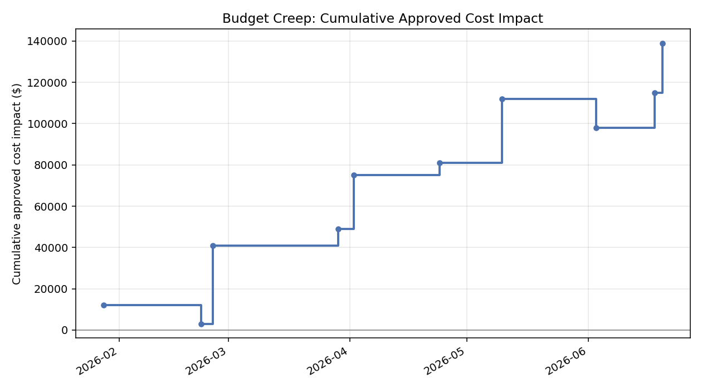
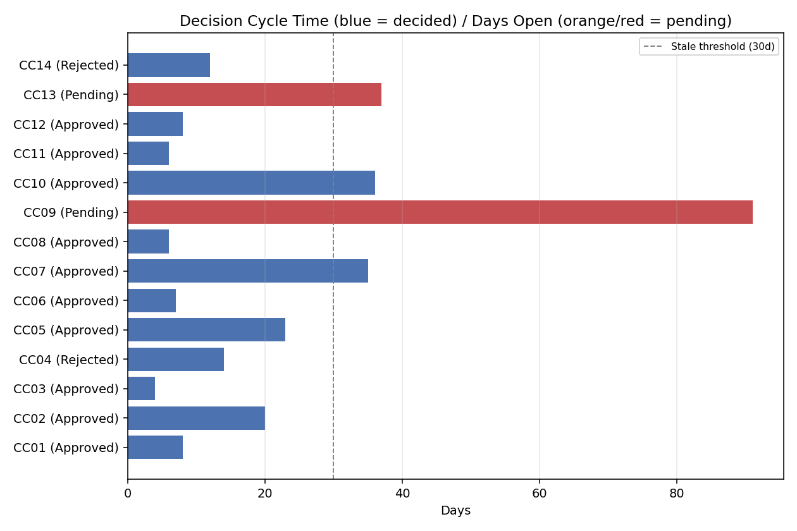

# Change Control Register

A Python tool that tracks a project's change log over time and answers the
questions a single change-register snapshot can't: how much has the budget
actually crept as changes get approved, how long is it taking to decide on
them, and which pending changes have been sitting undecided too long.

Part of a small project-controls toolkit:
[project-controls-dashboard](https://github.com/alexc-hue/project-controls-dashboard),
[schedule-health-analyzer](https://github.com/alexc-hue/schedule-health-analyzer),
**change-control-register** (this repo),
[risk-trend-tracker](https://github.com/alexc-hue/risk-trend-tracker).

## Problem

A change register usually gets reviewed as a point-in-time list: here are
the open changes, here's their cost impact, done. That misses the two
things that actually matter for change control as a process: is the
approved baseline quietly drifting upward change by change (budget creep),
and is the decision process itself healthy, or are changes sitting in
limbo for months while cost and schedule exposure sits unresolved.

## Approach

- Track every change with its raised date, decision date (if decided), cost
  and schedule impact, and status (Approved / Rejected / Pending).
- For decided changes, compute the decision cycle time (days from raised to
  decided). For pending ones, compute days open against a status date, and
  flag anything open longer than a stale threshold (30 days by default).
- Order approved changes by decision date and run a cumulative sum, cost and
  schedule impact separately, to show the actual shape of budget/schedule
  creep over the project's life rather than a single end total.
- Report approval rate and average cycle time as process-health indicators.

Deliberately not scored into a single 0-100 number the way the schedule
health tool is: approved change cost isn't inherently bad, a lot of it is
legitimate client-driven scope growth, so collapsing cost/schedule impact
into a good/bad score would misrepresent what the data means. This tool
reports clear descriptive metrics and flags instead.

The sample data is a fictional 14-change log on a compressor station
upgrade over about six months, with a mix of fast and slow approvals, two
rejected changes, and two changes still pending, one of them stale.

## Technology

Python, pandas for the cycle-time and cumulative-sum logic, matplotlib for
the charts.

## Result

```
CHANGE CONTROL REPORT
================================================================
Total changes logged: 14  (Approved 10, Rejected 2, Pending 2)
Approval rate (of decided changes): 83.3%
Average decision cycle time: 14.9 days
Stale pending changes (open > 30d): 2

Approved cost impact:     $139,000
Approved schedule impact: +38 days
Pending cost exposure:    $48,000
Pending schedule exposure: +9 days
```

A saved copy of this report, including the full change log, is generated
alongside the charts: see [assets/report.md](assets/report.md).

## Screenshots

**Budget creep** — cumulative approved cost impact, in the order changes
were decided.



**Decision cycle time** — days to decide for resolved changes (blue), days
open for pending ones (orange, red if stale).



## What I learned

The interesting number here isn't the total change impact, it's the shape
of the cumulative curve: a project where changes trickle in steadily reads
very differently to a sponsor than one where the same total cost impact
arrived in two large jumps late in the project. Keeping the cost/schedule
creep and the process-health metrics (cycle time, staleness) as separate,
plainly-labeled outputs rather than merging them into one score was the
right call here, a slow approval process and a large budget increase are
two different problems with two different owners, and conflating them
would make the report less actionable, not more.

## Limitations

- No workflow/approval-chain modeling (who approved it, at what authority
  level), just raised/decided dates and a final status.
- Cumulative impact is ordered by decision date, not by when the underlying
  cost was actually incurred, appropriate for tracking baseline drift, not
  a substitute for actual cost-to-date reporting.

## Run it

```bash
pip install -r requirements.txt
python change_control.py
```

Swap in your own `data/change_log.csv` (same columns) to point it at a real
change register.
